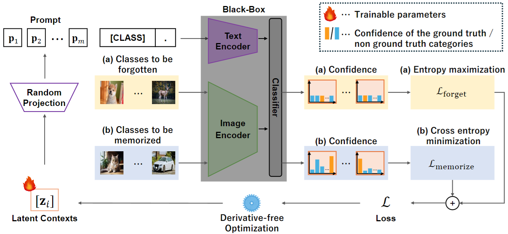

# Black-Box-Forgetting
We provide Pytorch implementation of the NeurIPS 2024 paper "[Black-Box Forgetting](https://arxiv.org/abs/2411.00409)".

## Abstract
<p align="center">

</p>

 Large-scale pre-trained models (PTMs) provide remarkable zero-shot classification capability covering a wide variety of object classes. However, practical applications do not always require the classification of all kinds of objects, and leaving the model capable of recognizing unnecessary classes not only degrades overall accuracy but also leads to operational disadvantages. To mitigate this issue, we explore the selective forgetting problem for PTMs, where the task is to make the model unable to recognize only the specified classes while maintaining accuracy for the rest. All the existing methods assume “white-box” settings, where model information such as architectures, parameters, and gradients is available for training. However, PTMs are often “black-box,” where information on such models is unavailable for commercial reasons or social responsibilities. In this paper, we address a novel problem of selective forgetting for black-box models, named Black-Box Forgetting, and propose an approach to the problem. Given that information on the model is unavailable, we optimize the input prompt to decrease the accuracy of specified classes through derivative-free optimization. To avoid difficult high-dimensional optimization while ensuring high forgetting performance, we propose Latent Context Sharing, which introduces common low-dimensional latent components among multiple tokens for the prompt. Experiments on four standard benchmark datasets demonstrate the superiority of our method with reasonable baselines. 

## Setup

### 1. Environment
Please follow the steps below to build your environment.

```bash
# Create a conda environment 
conda create -n bbf python=3.9
conda activate bbf

# Install torch and torchvision
# Please refer to https://pytorch.org/ if you need a different cuda version
conda install pytorch torchvision pytorch-cuda=12.1 -c pytorch -c nvidia

# Clone this repo
git clone https://github.com/yusukekwn/Black-Box-Forgetting.git
cd Black-Box Forgetting

# Install dependencies
pip install -r requirements.txt

# Finished
```

### 2. Data Preparation
#### CIFAR-10,CIFAR-100,CUB-200-2011
The dataset will be downloaded when the code is run.

#### ImageNet30
- Create a folder named `imagenet30/` under `./data/`
- Download the dataset from (https://github.com/hendrycks/ss-ood). 
- The directory structure should look like
```
data/
|-- imagenet30/
|   |-- one_class_train/
|   |-- one_class_test/
```

#### ImageNet
- Download the dataset from the [official website](https://image-net.org/index.php).
- The directory structure should look like
```
data/
|-- imagenet/
|   |-- train/ # contains 1,000 folders like n01440764, n01443537, etc.
|   |-- val/
```

### 3. Run
Train and test on the dataset.
``` bash
# CIFAR-10
# ours
bash ./scripts/run_cifar10.sh lcs 25 4
# bbt
bash ./scripts/run_cifar10.sh bbt 10 1
# ours w/o lcs
bash ./scripts/run_cifar10.sh ind 10 4
```
``` bash
# CIFAR-100, CUB-200-2011, ImageNet30, ImageNet
# ours
bash ./scripts/run_{dataset name}.sh lcs 500 16
# bbt
bash ./scripts/run_{dataset name}.sh bbt 125 1
# ours w/o lcs
bash ./scripts/run_{dataset name}.sh ind 125 16
```
